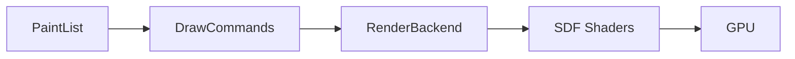

# Architecture Deep Dive

Fantasmagorie v3.0 combines a high-level UI layer (from v2) with a production-grade rendering backend (from v3).

## 1. Core Types (`core/types.hpp`)

Minimal, POD-like types for maximum performance:

```cpp
namespace fanta {
    struct Vec2 { float x, y; };
    struct Rect { float x, y, w, h; };
    struct Color { float r, g, b, a; };
    struct CornerRadius { float tl, tr, br, bl; };
    struct ElevationShadow { ShadowLayer ambient, key; };
}
```

## 2. Rendering Pipeline



### PaintList API
```cpp
PaintList paint;
paint.rect({0, 0, 100, 50}, Color::Hex(0xFF5500FF));
paint.circle({50, 50}, 20, Color::White());
paint.line({0, 0}, {100, 100}, Color::Black(), 2.0f);
paint.text({10, 10}, "Hello", 24.0f);

backend.execute(paint);
```

### Draw Commands
- `RectCmd` - Rounded rectangles with shadows
- `CircleCmd` - Circles with SDF rendering
- `LineCmd` - Anti-aliased lines
- `TextCmd` - FreeType + SDF text

## 3. UI Layer (from v2)

### NodeStore (SoA Model)
```cpp
struct NodeStore {
    std::unordered_map<NodeID, NodeTree>          tree;
    std::unordered_map<NodeID, LayoutConstraints> constraints;
    std::unordered_map<NodeID, LayoutData>        layout;
    std::unordered_map<NodeID, ResolvedStyle>     style;
};
```

### Builder Pattern Widgets
```cpp
fanta::Button("Submit")
    .width(200)
    .on_click([]{ /* action */ })
    .build();
```

## 4. Animation System (`core/animation.hpp`)

### Spring Physics
```cpp
Spring spring = Spring::gentle();
spring.update(animatedValue, dt);
```

### Tween
```cpp
Tween tween;
tween.duration(0.3f)
     .easing(easing::ease_out_cubic)
     .start();
```

## 5. Path System (`core/path.hpp`)

SVG-like path construction with adaptive Bezier tessellation:

```cpp
Path path = Path::rounded_rect({0, 0, 100, 50}, CornerRadius(8));
Path circle = Path::circle({50, 50}, 25);
Path star = Path::star({100, 100}, 50, 25, 5);
```

## 6. Pimpl Pattern (Header Safety)

OpenGL/platform details hidden via Pimpl:

```cpp
// opengl.hpp - NO GL headers
class RenderBackend {
    std::unique_ptr<RenderContextImplementation> impl_;
public:
    void execute(const PaintList& list);
};
```
